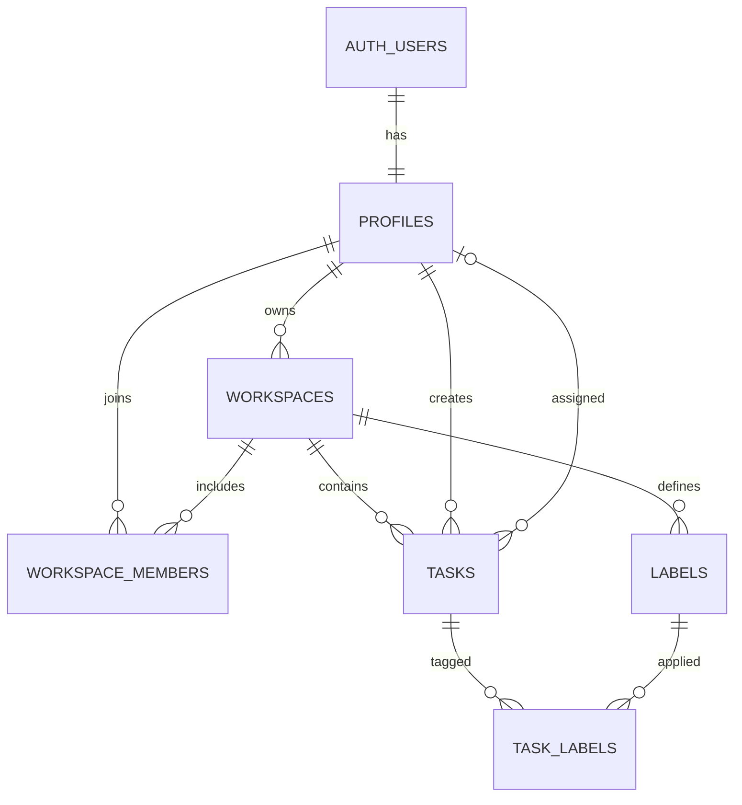

# Database Design

**Status:** Initial design
**Related issue:** #4
**Database:** PostgreSQL provided by Supabase

## 1. Overview

The database stores user profiles, workspaces, workspace memberships, tasks, labels, and the relationships between tasks and labels.

Supabase Auth manages credentials and sessions in its private authentication schema. The application database stores only the additional profile information needed by the Collaborative Study Planner.

## 2. Design goals

The initial database design should:

* Preserve data integrity with keys and constraints
* Prevent data from one workspace appearing in another
* Support secure ownership and membership checks
* Allow tasks to have multiple labels
* Store dates and times consistently
* Support common queries efficiently
* Leave room for collaboration without requiring it in the first MVP
* Avoid storing passwords or duplicated authentication credentials

## 3. Entity-relationship diagram

## 4. Tables

### `profiles`

Stores application-specific information about an authenticated user. It does not store passwords.

| Column         | Type          | Required | Description                                           |
| -------------- | ------------- | -------: | ----------------------------------------------------- |
| `id`           | `uuid`        |      Yes | Primary key and foreign key to the Supabase Auth user |
| `display_name` | `text`        |      Yes | Name displayed inside the application                 |
| `created_at`   | `timestamptz` |      Yes | Time the profile was created                          |
| `updated_at`   | `timestamptz` |      Yes | Time the profile was last updated                     |

Constraints:

* `id` is the primary key.
* `id` references the corresponding Supabase Auth user.
* Deleting the authentication record deletes the related profile.
* `display_name` must contain between 1 and 80 characters after trimming.

Notes:

* Email addresses and password data remain managed by Supabase Auth.
* A profile should be created automatically when a user registers.

### `workspaces`

Stores a collection of related study tasks.

| Column        | Type          | Required | Description                           |
| ------------- | ------------- | -------: | ------------------------------------- |
| `id`          | `uuid`        |      Yes | Primary key                           |
| `owner_id`    | `uuid`        |      Yes | User who owns the workspace           |
| `name`        | `text`        |      Yes | Workspace name                        |
| `description` | `text`        |       No | Optional explanation of the workspace |
| `created_at`  | `timestamptz` |      Yes | Time the workspace was created        |
| `updated_at`  | `timestamptz` |      Yes | Time the workspace was last updated   |

Constraints:

* `id` is the primary key.
* `owner_id` references `profiles.id`.
* `name` must contain between 1 and 100 characters after trimming.
* Deleting the owner deletes the workspace and its dependent records.

Notes:

* The owner must also have an `owner` entry in `workspace_members`.
* Workspace creation should insert the workspace and its owner membership in one database transaction.

### `workspace_members`

Records which users can access each workspace.

| Column         | Type          | Required | Description                     |
| -------------- | ------------- | -------: | ------------------------------- |
| `workspace_id` | `uuid`        |      Yes | Workspace being joined          |
| `user_id`      | `uuid`        |      Yes | User belonging to the workspace |
| `role`         | `text`        |      Yes | Member permission level         |
| `joined_at`    | `timestamptz` |      Yes | Time the membership began       |

Constraints:

* The combined primary key is `workspace_id` and `user_id`.
* `workspace_id` references `workspaces.id`.
* `user_id` references `profiles.id`.
* `role` must be either `owner` or `member`.
* Deleting a workspace deletes its memberships.
* Deleting a profile deletes that user's memberships.

Notes:

* The MVP creates only owner memberships.
* Invitations and additional members are deferred until collaboration is implemented.
* `workspaces.owner_id` remains the authoritative record of workspace ownership.

### `tasks`

Stores study tasks belonging to a workspace.

| Column         | Type          | Required | Description                    |
| -------------- | ------------- | -------: | ------------------------------ |
| `id`           | `uuid`        |      Yes | Primary key                    |
| `workspace_id` | `uuid`        |      Yes | Workspace containing the task  |
| `created_by`   | `uuid`        |       No | User who created the task      |
| `assigned_to`  | `uuid`        |       No | User assigned to the task      |
| `title`        | `text`        |      Yes | Short task title               |
| `description`  | `text`        |       No | Optional task details          |
| `status`       | `text`        |      Yes | Current workflow status        |
| `priority`     | `text`        |      Yes | Task priority                  |
| `due_at`       | `timestamptz` |       No | Optional deadline              |
| `completed_at` | `timestamptz` |       No | Time the task was completed    |
| `created_at`   | `timestamptz` |      Yes | Time the task was created      |
| `updated_at`   | `timestamptz` |      Yes | Time the task was last updated |

Constraints:

* `id` is the primary key.
* `workspace_id` references `workspaces.id`.
* `created_by` references `profiles.id`.
* `assigned_to` references `profiles.id`.
* `title` must contain between 1 and 200 characters after trimming.
* `status` must be `todo`, `in_progress`, or `done`.
* `priority` must be `low`, `medium`, or `high`.
* A task with the `done` status should have a `completed_at` value.
* A task not marked as `done` should have a null `completed_at` value.
* Deleting a workspace deletes all its tasks.
* Deleting a profile sets matching `created_by` and `assigned_to` values to null.

Notes:

* The API must confirm that an assigned user belongs to the task's workspace.
* The API must update `status` and `completed_at` together.
* Task ordering for a future drag-and-drop board is not included in the initial design.

### `labels`

Stores reusable labels belonging to a workspace.

| Column         | Type          | Required | Description                                 |
| -------------- | ------------- | -------: | ------------------------------------------- |
| `id`           | `uuid`        |      Yes | Primary key                                 |
| `workspace_id` | `uuid`        |      Yes | Workspace containing the label              |
| `name`         | `text`        |      Yes | Label name                                  |
| `color`        | `text`        |      Yes | Display color stored as a hexadecimal color |
| `created_at`   | `timestamptz` |      Yes | Time the label was created                  |
| `updated_at`   | `timestamptz` |      Yes | Time the label was last updated             |

Constraints:

* `id` is the primary key.
* `workspace_id` references `workspaces.id`.
* `name` must contain between 1 and 40 characters after trimming.
* Label names must be unique within a workspace, ignoring capitalization.
* `color` must use the `#RRGGBB` format.
* Deleting a workspace deletes its labels.

### `task_labels`

Creates the many-to-many relationship between tasks and labels.

| Column         | Type          | Required | Description                            |
| -------------- | ------------- | -------: | -------------------------------------- |
| `workspace_id` | `uuid`        |      Yes | Workspace shared by the task and label |
| `task_id`      | `uuid`        |      Yes | Task receiving the label               |
| `label_id`     | `uuid`        |      Yes | Label applied to the task              |
| `created_at`   | `timestamptz` |      Yes | Time the label was applied             |

Constraints:

* The combined primary key is `task_id` and `label_id`.
* `task_id` and `workspace_id` must identify a task in the same workspace.
* `label_id` and `workspace_id` must identify a label in the same workspace.
* Deleting a task removes its task-label relationships.
* Deleting a label removes its task-label relationships.

Notes:

* Including `workspace_id` prevents a label from one workspace being attached to a task in another workspace.
* Composite foreign keys will enforce this relationship when the SQL migration is written.

## 5. Relationships

The main relationships are:

* One authentication user has one application profile.
* One profile can own many workspaces.
* One workspace can have many members.
* One profile can belong to many workspaces.
* One workspace can contain many tasks.
* One profile can create or be assigned many tasks.
* One workspace can define many labels.
* One task can have many labels.
* One label can be applied to many tasks.

The `workspace_members` and `task_labels` tables resolve many-to-many relationships.

## 6. Default values

The initial migration should provide these defaults:

* UUID primary keys use a database-generated random UUID.
* Timestamp columns use the current time.
* `tasks.status` defaults to `todo`.
* `tasks.priority` defaults to `medium`.
* `workspace_members.role` defaults to `member`.
* `labels.color` uses an approved default color if none is selected.

All timestamps will be stored using `timestamptz` and interpreted as UTC. The client may display them in the user's local time zone.

## 7. Deletion behavior

| Deleted record      | Result                                                             |
| ------------------- | ------------------------------------------------------------------ |
| Authentication user | Delete the related profile                                         |
| Workspace owner     | Delete workspaces owned by that profile                            |
| Workspace           | Delete memberships, tasks, labels, and task-label relationships    |
| Non-owner profile   | Delete memberships and clear task creator or assignment references |
| Task                | Delete related task-label relationships                            |
| Label               | Delete related task-label relationships                            |

Destructive actions such as deleting a workspace must require confirmation in the user interface.

## 8. Indexes

PostgreSQL automatically creates indexes for primary keys and unique constraints. Additional indexes should support common application queries.

Planned indexes include:

* `workspaces(owner_id)`
* `workspace_members(user_id)`
* `tasks(workspace_id, status)`
* `tasks(workspace_id, priority)`
* `tasks(workspace_id, due_at)`
* `tasks(assigned_to)`
* A unique case-insensitive index on `labels(workspace_id, lower(name))`
* `task_labels(label_id)`

Indexes should be added because a real query requires them, not merely because a column exists.

## 9. Authorization rules

### Workspace owner

An owner can:

* Read their workspace
* Rename or delete their workspace
* Create, read, update, and delete tasks
* Create, read, update, and delete labels
* Manage members when collaboration is implemented

### Workspace member

A future member can:

* Read a workspace they have joined
* Read tasks and labels in that workspace
* Create tasks
* Update tasks according to the final collaboration rules

Member invitations and detailed member permissions are outside the MVP.

### Unauthenticated visitor

An unauthenticated visitor cannot read or change private application data.

## 10. Row Level Security

Row Level Security should be enabled on all application tables exposed through Supabase.

The initial policy design should ensure that:

* Users can read and update only their own profile.
* Users can read workspaces in which they have a membership.
* Only owners can update or delete their workspaces.
* Users can read tasks and labels only within accessible workspaces.
* Only authorized workspace users can create or change records.
* Direct anonymous database access cannot read private data.

The Express API must still validate every request and enforce authorization. The Supabase service-role credential bypasses Row Level Security and must remain restricted to trusted backend code.

Actual policies will be created and tested in a later database migration pull request.

## 11. Data integrity rules

The database and API must work together to ensure that:

* Every workspace has exactly one owner.
* The workspace owner also has an owner membership.
* Task assignees belong to the relevant workspace.
* Tasks and labels in `task_labels` belong to the same workspace.
* Completed tasks have a completion timestamp.
* Empty or whitespace-only names and titles are rejected.
* User-supplied identifiers are never trusted without authorization checks.

Rules that can be expressed safely as database constraints should be enforced by the database. Rules involving application permissions should also be checked by the API.

## 12. Migration strategy

Database changes will be stored as version-controlled SQL migrations.

Each migration should:

* Have one clear purpose
* Be reviewed through a pull request
* Avoid containing credentials
* Be tested against the development database
* Include a safe rollback or correction plan
* Update this document when the design changes

The production database must not be changed manually without recording the equivalent migration in Git.

## 13. Deferred database features

The initial database will not include:

* Comments
* Activity-history records
* Notifications
* File attachments
* Calendar integrations
* Real-time presence
* Audit-log storage
* Task-ordering positions
* Archived-workspace support

These tables and fields should be added only when their features are implemented.
